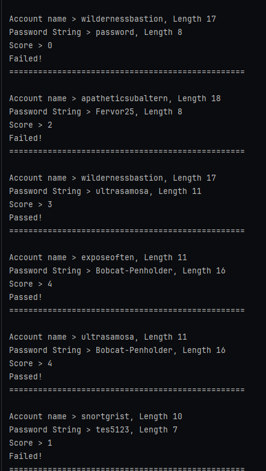

# Password Filter Checker
This DLL is designed for password verification and works in conjunction with the Local Security Authority Subsystem Service (LSASS) to ensure that the password provided meets at least Level 3 of the ZXCVBN password strength requirements.
Specifically, the password must be resistant to cracking with fewer than 10^10 (10 Billion) guesses.

## The Password Filter DLL can be Installed & Registers via the Following Method
- Store DLL inside \Windows\System32
    - 64 Bit Binary For 64 bit Windows & 32 Bit Binary for 32 Bit Windows
- Update the Registry Key "HKEY_LOCAL_MACHINE\\SYSTEM\\CurrentControlSet\\Control\\Lsa" to Point to the New Password Filter (Dont Include the .DLL)
    - Update the Password Complexity Settings in the Control Panel -> Performance and maintenance -> Administrative Tools -> Local Security Policy -> Account Policies -> Password Policy
    - Enable Passwords must meet complexity requirements policy setting

## Images


## Build Instructions
```cmd
cargo build --profile release
```

## References
    - https://learn.microsoft.com/en-us/windows/win32/api/ntsecapi/nc-ntsecapi-psam_password_filter_routine
    - https://docs.rs/zxcvbn/latest/zxcvbn/
    - https://learn.microsoft.com/en-us/host-integration-server/esso/how-to-use-password-filters
    - https://learn.microsoft.com/en-us/windows/win32/secmgmt/installing-and-registering-a-password-filter-dll